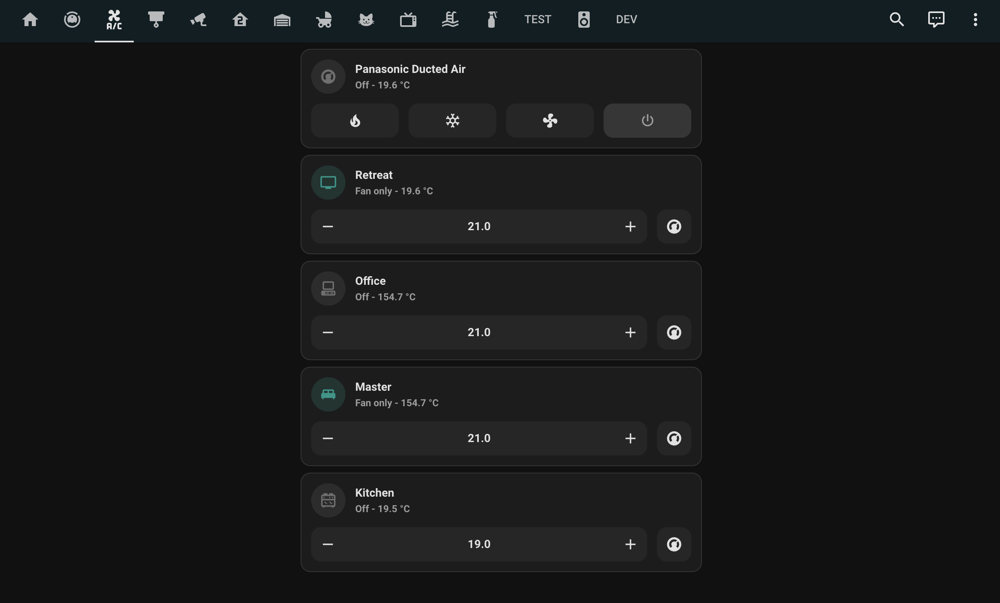

# Air Conditioning
Control panel for house is located upstairs in the retreat. It is the tablet with the white border at eye level on the wall opposite the stairs.
## Retreat Controller
1. Hit the white physical button to turn the screen on.
2. Adjust settings and zones to have running
3. Press the power symbol to turn on and off.

## Kitchen Tablet
A/C can also be controlled on the A/C tab of the kitchen tablet.

## Manual

Click the link below to download a copy of the manual.

[Download Manual](_media/manuals/airtouch-4-manual.pdf ':ignore')
