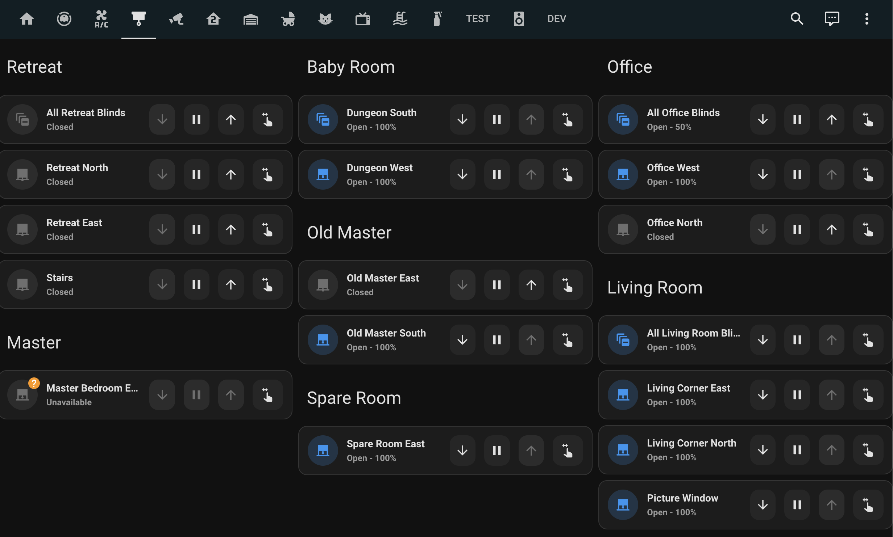

# Blinds
All blinds in the house are battery powered, remote control blinds. These can either be controlled via the white remotes, or the kitchen tablet
## White Remotes
Each room will have a white remote for the blinds.
- `+` / `-` are for selected the blind. `0` will control all blinds connected to the remote at once.
- `▲` / `▼` are for opening or closing the blind
- `■` is to stop the blind from moving

The remote in the first spare bedroom on the left also controls the living room blinds.

## Kitchen Tablet
Blinds can also be adjusted from the kitchen tablet on blinds tab:

