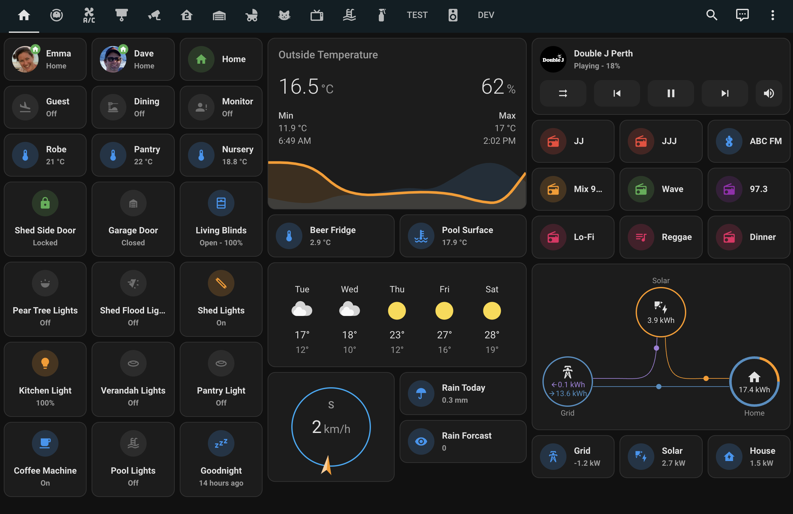

# Entertainment

The house has music and radio through out via SONOS wireless speakers. These can either be controlled via the app if on the correct network.

The kitchen tablet has a selection of playlists and radio stations pre-programmed that will start music or radio on the kitchen speaker.

