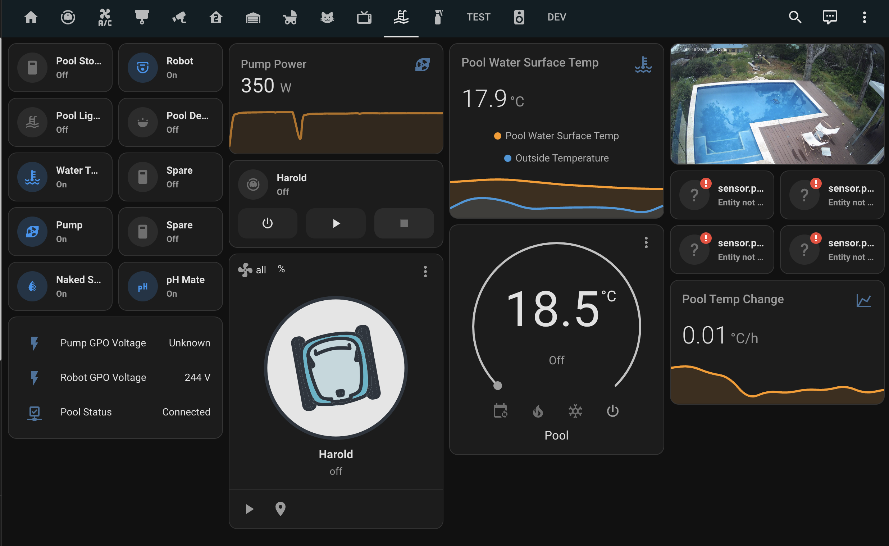

# Pool
The pool is a [Naked Freshwater Pool](https://naked-pools.com/) that uses a mixture of a traditional SWG (Salt Water Generator) and Copper ions to keep the water sanitary. The chlorine levels are extremely low and the water in the pool is drinkable. The pump circulated 24/7 at a low speed to help keep dirt and leaves in the filters and baskets. Chemical should all be balanced and not require any input from yourselves. The system is mostly automated and shouldn't require too much care besides giving the skimmer basket and vacuum basket a clean once a week or so.

Most things can be found in either the deck lazarette which houses the robots control unit, or under the deck in the pump room.

## Skimmer basket
As we have a few trees around, I tend to give this a clean out every 1-2 weeks. The decking boards above it are currently loose and can be lifted to expose the skimmer box. Leaves can simply be removed by hand without taking the basket out and dumped under the deck.

## Dolphin Pool Cleaner
We tend to leave the robot in the pool 24/7, but feel free to remove it when you are having a swim if you want. This cleaner is on a daily timer to run for 2 hours at 1am, 7am and 11am. This keeps the pool pretty clean and reduces the need to do much other cleaning.

I empty the basket on this unit about once a week. This can be done by slowly retrieving the robot via the umbilical cable. Once close to the surface, remove from the pool via the handle. The top hatch can then be opened and the basket removed for cleaning.

!> Do not pull the blue cable too hard or attempt to pull the robot out of the pool with it as it will damage the unit.

Video showing how to clean the basket.

<iframe class="responsive-iframe" src="https://www.youtube.com/embed/_WUxRhX6IjIsi=b3FPCL30vabY5OnP" title="YouTube video player" frameborder="0" allow="accelerometer; autoplay; clipboard-write; encrypted-media; gyroscope; picture-in-picture; web-share" allowfullscreen></iframe>

## Water Level
Depending on the weather the pool may need topping up every other week. We usually keep 3 rows of mosaic tiles out of the water. If it drops below 5, top the pull up with water from the garden hose.

## Pump
The variable speed pump is set to run at 140L/min 24/7 to help keep the water clean. It is located in the pump room under the pool deck.

## Naked System
The naked system will automated the SWG and Copper rods to sanitise the pool. This occurs between 8am - 2pm.

## pH Mate
The pool has an automatic pH doser that will keep the pH ~7.4 and add acid as required.

## Heat Pump
The pool has a heat pump on it that is generally off, but can be turned on if you would like the pool to be a bit warmer. We generally set this to 27 degrees and can be controlled from the unit itself in the pump room.

Heat Pump manual can be found here:

[Download Manual](_media/manuals/heat-pump.pdf ':ignore')

## Tablet Control

Most of the pool automation is also hooked into the kitchen tablet and can be monitor and controlled from there.

