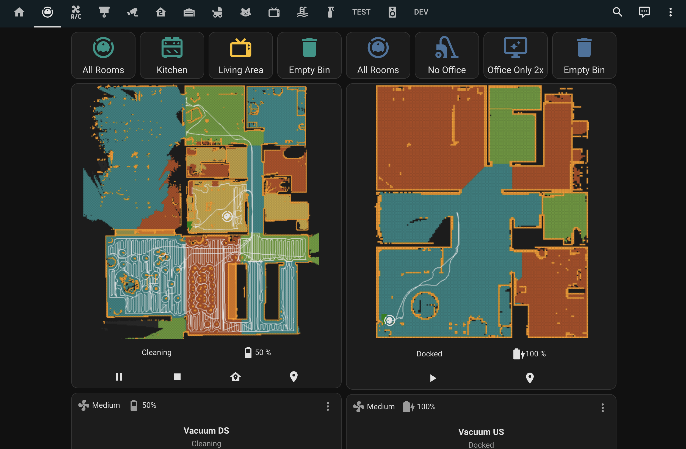

# Vacuums
We mainly vacuum the house with the two robotic vacuum cleaners, one on each level. We also have a stick vacuum in the cats room under the stairs.

## Starting robotic vacuum cleaners
Vacuums can be started from the kitchen tablet on vacuums tab:

?> **Note** The bins will need emptying from the units after each run. They should park up at a convenient location after cleaning. If not, hit the button in the screenshot above.

!> **Note** If a robot gets left to long off base it will eventually run out of battery. If this happens, just take the vacuum back to it's base and put it back on. You should hear a noise to confirm that it is charging again.

## Emptying the bins
The bins will generally need emptying after each run of a full floor.

This video will show you how. Don't worry about cleaning the screen, or washing the filter:

<iframe class="responsive-iframe" src="https://www.youtube.com/embed/zL3ztCynHIY" title="How to clean roborock 5" frameborder="0" allow="accelerometer; autoplay; clipboard-write; encrypted-media; gyroscope; picture-in-picture; web-share" allowfullscreen></iframe>

